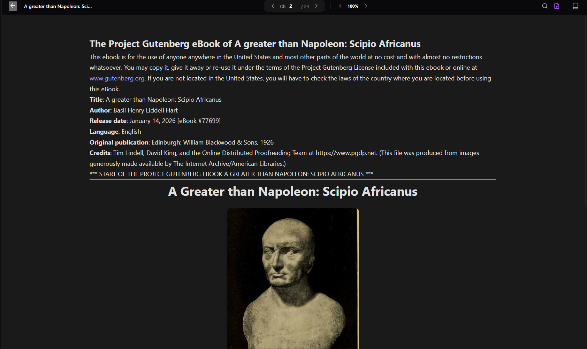
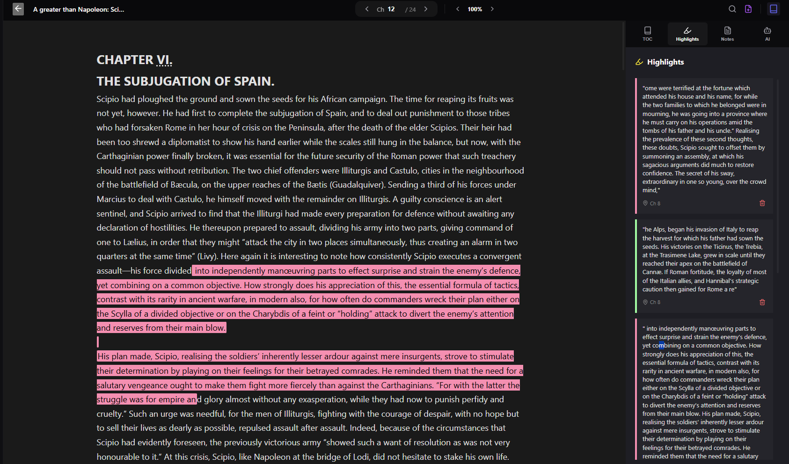

<div align="center">
  <h1>Vinyl 🎧📖</h1>
  <p><strong>A Next-Generation AI-Powered EPUB & PDF Reader</strong></p>
  <p><i>Beta Version</i></p>
</div>

---

<p align="center">
  
</p>

## ✨ Overview

**Vinyl** is a beautifully crafted, Tauri-based Rust application designed to elevate your reading and research experience. Combining the speed and security of Rust with a sleek UI, Vinyl lets you dive deep into your EPUBs and PDFs.

More than just a reader, Vinyl is built with an integrated AI that allows you to chat directly with specific paragraphs—unlocking deeper insights, summaries, and explanations right where you need them.

## 🚀 Features

- 📚 **Multi-Format Support:** Seamlessly read **EPUB** and **PDF** files with a smooth, native-like experience.
- 🤖 **Contextual AI Chat:** Select any paragraph and instantly chat with our integrated AI to summarize, explain, or explore concepts further.
- 💻 **Built-In Code Editor:** A fully functional code editor built right into the app for those who like to code while they read.
- 🕵️ **AI Agent (Experimental):** An integrated AI agent capable of assisting you (currently a work-in-progress/broken, but evolving fast!).
- ⚡ **Lightning Fast:** Built on **Tauri** and **Rust** for minimal memory footprint and blazing fast performance.

---

## 📸 Screenshots

| Reading Interface | AI Assistant in Action | Code Editor |
| :---: | :---: | :---: |
|  |  |  |

*(See `images/s6.png` and others in the `images` folder for more!)*

---

## 🛠️ How to Use & Open It

### Prerequisites

You'll need the following installed on your machine:
- [Rust](https://www.rust-lang.org/tools/install)
- [Node.js](https://nodejs.org/) (with `npm` or `yarn` or `pnpm`)
- OS-specific build tools for Tauri (e.g., Visual Studio C++ Build Tools on Windows).

### Installation & Running Locally

1. **Clone the repository:**
   ```bash
   git clone https://github.com/Simangka/Vinyl.git
   cd Vinyl
   ```

2. **Install dependencies:**
   ```bash
   npm install
   ```

3. **Run the app in development mode:**
   ```bash
   npm run tauri dev
   ```
   *This command will compile the Rust backend and launch the frontend application. Sit back and wait a moment for the window to appear!*

4. **Building for Production:**
   ```bash
   npm run tauri build
   ```
   *This will generate an installer/executable for your operating system.*

---

## ⚠️ Disclaimer

- **Beta Software:** This is an early beta version. Some features, particularly the AI agent, are currently experimental and might not work perfectly.
- **Privacy First:** We respect your data! By default, user keys, chat history, and uploaded documents are ignored from version control to ensure your data never leaks.

---

<div align="center">
  <i>Crafted with 🖤 for readers and coders alike.</i>
</div>
